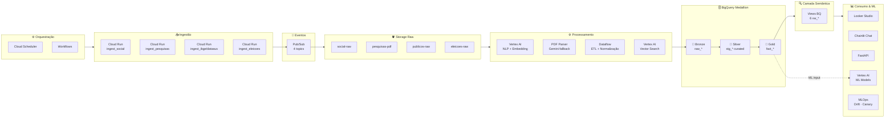

# BRAINSTORM — SPEPE
**Sistema de Perfilamento do Eleitorado e Previsão Eleitoral**

> Phase 0 — Atualizado em: 2026-05-06
> Versão: 4.0 — 13 módulos completos: +CadÚnico/BF, +Emendas Parlamentares, +CEIS+CNEP Sanções; total 19 Cloud Run Jobs
> Próximo passo: `/iterate .claude/sdd/features/DEFINE_SPEPE.md`

---

## Princípio de Arquitetura

> **Ingestão separada, dados padronizados, análise unificada.**

Cada fonte tem seu pipeline próprio. Tudo converge para um modelo comum. O consumo final é único.

> *"Terraform organiza a fundação, GCP hospeda os módulos, BigQuery centraliza a inteligência, Vertex AI amplia a capacidade analítica, e os cinco domínios de dados alimentam um único núcleo de decisão eleitoral."*

---

## Síntese Final

> Um sistema modular de dados + ML + sinais digitais, capaz de integrar comportamento histórico, contexto estrutural, intenção declarada e narrativa em tempo real para prever cenários eleitorais com explicabilidade.

### Regra de Integração das Camadas

| Camada | Papel |
|--------|-------|
| **Dados estruturais** | Explicam — perfil socioeconômico, IDH, renda, escolaridade definem o contexto base |
| **Histórico eleitoral** | Valida — padrões de voto 2014→2022 ancoram a previsão na realidade observada |
| **Pesquisas** | Calibram — intenção declarada ajusta o modelo, descontando house effect por instituto |
| **Sinal digital** | Antecipa — menções, sentimento e ad spend capturam o momento antes das urnas |
| **Modelo bayesiano** | Integra — produz `P(X) = N% [IC 95%]` com premissas declaradas e SHAP explicável |

---

## Pergunta Central (expandida)

> Dado o perfil socioeconômico de uma região e o comportamento eleitoral histórico observado (2014–2022), **qual arquétipo de eleitor habita aquela região, qual a probabilidade de cada candidato ser eleito ali, e quais variáveis explicam essa probabilidade** — com intervalo de credibilidade declarado?

---

## Três Entregas Finais (não negociáveis)

| # | Entrega | Forma |
|---|---------|-------|
| **1** | **Mapa de Arquétipos do Eleitorado** — clusters demográficos + comportamentais por município | Mapa interativo BR + fichas por arquétipo |
| **2** | **Probabilidade de Eleição por Candidato** — com intervalo de credibilidade 95% e premissas declaradas | Output conversacional + dashboard |
| **3** | **Explicabilidade** — quais variáveis mais pesam na previsão de cada candidato em cada arquétipo | SHAP values + narrativa em linguagem natural |

---

## Visão Geral

O SPEPE é um **sistema conversacional multi-agente com pipeline de ML/estatística completo**, especializado em análise e previsão eleitoral brasileira. Combina:

- **Infraestrutura conversacional**: Claude SDK, Chainlit UI, agentes especializados, slash commands
- **Pipeline de dados medallion**: Bronze → Silver → Gold, com ~200 variáveis por município × eleição
- **ML não-supervisionado**: clusterização geográfica → arquétipos sociológicos do eleitorado
- **ML supervisionado Bayesiano**: modelo hierárquico com bootstrap, IC 95%, SHAP
- **Sinal digital agregado**: redes sociais, Google Trends, pesquisas — sempre em nível de município/cluster (LGPD)
- **Plataforma GCP**: Cloud Run + BigQuery + Vertex AI + Dataplex, região southamerica-east1

**Ambição declarada:** tese de mestrado + portfólio sênior + produto comercializável.

---

## Módulos de Dados — 10 Módulos Implementados / Planejados

| # | Módulo | Status | Fontes | Tabela Gold | Agente |
|---|--------|--------|--------|-------------|--------|
| 1 | **Eleições** | ✅ Fase 1 | TSE resultados 2018/2022 | `fact_municipio_eleicao`, `fact_secao_eleicao`, `fact_candidato_dia` | coletor, analista |
| 2 | **IBGE Estrutural** | ✅ Fase 1 expandido | SIDRA (Censo 2022, PNAD), IPEADATA (Gini) | `fact_municipio_eleicao` (~240 features) | analista |
| 3 | **Pesquisas Eleitorais** | ✅ Fase 1 | TSE PesqEle, Atlas Político | `fact_pesquisa` | modelista_bayesiano |
| 4 | **Segurança Pública** | ✅ Fase 1 | Atlas da Violência (IPEA), IVS (IPEA), SINESP | `fact_seguranca_municipio` | analista_seguranca |
| 5 | **DataSUS — Saúde** | ✅ Fase 1 | DataSUS SIM (IPEADATA), ANS | `fact_saude_municipio` | analista |
| 6 | **DIEESE — Custo de Vida** | ✅ Fase 1 | DIEESE Cesta Básica (IPEADATA) | `fact_economico_municipio` | analista |
| 7 | **CETIC — Inclusão Digital** | ✅ Fase 1 | CETIC TIC Domicílios | `fact_municipio_eleicao` (pct_internet_domiciliar) | analista |
| 8 | **Social — Sinal Digital** | 🔶 Fase 2 | Twitter/X, YouTube, Meta Ads, Google Trends | `fato_social`, `fact_candidato_dia` | coletor (digital) |
| 9 | **MLOps** | 🔶 Fase 3 | Vertex AI, modelos PyMC | `fact_predictions` | modelista_bayesiano |
| 10 | **Geoespacial** | 🔶 Fase 2 | IBGE malha municipal, IBGE RM | `dim_territorio` (atualizar) | analista |
| 11 | **Transferências Sociais** | ✅ Fase 1 | Portal da Transparência — CadÚnico + Bolsa Família | `fact_transferencias_sociais` | analista |
| 12 | **Emendas Parlamentares** | ✅ Fase 1 | Portal da Transparência — `/emendas-parlamentares` | `fact_emendas_parlamentar + fact_emendas_municipio` | analista |
| 13 | **Ficha Suja (CEIS+CNEP)** | ✅ Fase 1 | Portal da Transparência — CEIS + CNEP | `fact_sancoes_uf` | analista |

---

## Fontes de Dados — Completas

### Cloud Storage — Zona de Pouso Raw (antes do Medallion)

Cada módulo grava os arquivos brutos exatamente como vieram da fonte:

| Bucket | Conteúdo |
|--------|----------|
| `social-raw` | raw JSON de redes sociais |
| `pesquisas-pdf` | PDFs + CSVs do TSE PesqEle |
| `publicos-raw` | IBGE + DataSUS parquet |
| `eleicoes-raw` | TSE zips + parquet |

> GCS é zona de pouso imutável — não é camada do Medallion. O Medallion começa no BigQuery.

### BigQuery Medallion — Bronze / Silver / Gold

#### Bronze — Staging (dados brutos carregados no BQ, como vieram)

| Fonte | Conteúdo | Formato | Granularidade |
|-------|----------|---------|---------------|
| **TSE — Resultados** | Votos por seção, 2014/2018/2022 | CSV/zip | Seção eleitoral |
| **TSE — Perfil do Eleitorado** | Sexo, faixa etária, escolaridade, estado civil | CSV | Zona/município |
| **TSE — PesqEle** | Pesquisas registradas 2014–2025 | CSV | Nacional/UF |
| **TSE — Candidaturas** | Bens, financiamento, coligações | CSV | Candidato |
| **IBGE — Censo 2022** | Renda, escolaridade, cor/raça, religião, urbanização | CSV | Setor censitário |
| **DataSUS** | Cobertura, mortalidade, internações, vulnerabilidades sanitárias | CSV/API | Município |
| **INEP / Atlas Brasil** | IDH, educação | CSV/API | Município |
| **Meta Ad Library** | Anúncios políticos: gasto, alcance, criativo | API | Candidato × dia |
| **Google Ads Transparency** | Anúncios políticos Google | API | Candidato × dia |
| **YouTube** | Vídeos e comentários políticos (API oficial) | JSON | Canal × vídeo |
| **TikTok** | Research API (acesso acadêmico) | JSON | Conta × vídeo |
| **Twitter/X** | Dados acadêmicos ou scraping limitado | JSON | Tweet |
| **Reddit** | r/brasil, r/politica | API/pushshift | Post × comentário |
| **Google Trends** | Buscas por candidato/partido por UF | CSV/API | UF × semana |
| **Portal Câmara/Senado** | Votações, presença, gastos de gabinete | API REST | Parlamentar × sessão |
| **CadÚnico / Bolsa Família** | Famílias cadastradas, beneficiários BF, extrema pobreza | Portal da Transparência API | Município × ano |
| **Emendas Parlamentares** | Valor empenhado/liquidado/pago por parlamentar × município × área temática | Portal da Transparência API | Município × parlamentar × ano |
| **CEIS + CNEP (Sanções)** | Cadastro de Empresas Inidôneas/Suspensas + Empresas Punidas — PF e PJ | Portal da Transparência API | Nacional (sem recorte temporal) |

#### Silver — Curated (limpo, padronizado, joinable)

- Chave unificada: `cd_municipio_ibge` (7 dígitos) para todos os datasets
- Chave candidato: `cpf_candidato` normalizado + `sq_candidato` TSE
- Textos de redes sociais com idioma, sentimento e tópico já extraídos (LLM + classificador)
- Séries temporais alinhadas: diárias para digital, semanais para pesquisa, eleição como evento

#### Gold — Analytics (~200 variáveis)

| Tabela | Granularidade | Variáveis | Uso |
|--------|--------------|-----------|-----|
| `fact_municipio_eleicao` | Município × eleição | ~200 (censo + TSE + IDH + digital agregado) | Clusterização + modelo |
| `fact_candidato_dia` | Candidato × dia | ~40 (digital: mentions, sentiment, ad spend, trends) | Sinal digital |
| `fact_pesquisa` | Pesquisa × rodada | ~20 (house effect, margem, erro observado pós-eleição) | Agregação bayesiana |
| `fact_transferencias_sociais` | Município × ano | BF beneficiários/valor, CadÚnico famílias, extrema pobreza | Feature matrix social |
| `fact_emendas_parlamentar + fact_emendas_municipio` | Município × parlamentar × ano | Valor empenhado/liquidado/pago, área temática, tipo emenda | Clientelismo × voto |
| `fact_sancoes_uf` | Sancionado × registro | CEIS+CNEP, PF+PJ, uf, tipo sanção, datas | "Eleitores punem ficha suja?" |

---

## Pipeline de ML/Estatística

### Stage 1 — Perfilamento do Eleitorado (não-supervisionado)

**Objetivo:** descobrir arquétipos de eleitorado sem rótulo prévio.

**Pipeline:**
```
fact_municipio_eleicao (~200 features)
    ↓ normalização (StandardScaler)
    ↓ redução de dimensionalidade (PCA 50 componentes)
    ↓ clusterização (HDBSCAN primário / K-means / GMM como alternativas)
    ↓ visualização (UMAP 2D)
    ↓ rotulação sociológica (LLM interpreta centroides)
    → N arquétipos validados sociologicamente
```

**Exemplos de arquétipos esperados:**

| Arquétipo | Perfil típico | Feature dominante |
|-----------|--------------|-------------------|
| Interior evangélico conservador | Baixa escolaridade, renda baixa, rural | % voto Bolsonaro 2022 alto |
| Metrópole jovem progressista | Alta escolaridade, urbano, jovem | % voto Lula 2022 alto |
| Agro tradicional | Renda média-alta, rural, branco | Conservador histórico |
| Nordeste Bolsa Família | Baixíssima renda, IDH baixo, rural | Dependência transferências |
| Sul europeu | Escolaridade alta, descendência europeia | Voto volátil |
| Periferia urbana | Baixa renda, jovem, urbano | Oscilação 2018→2022 alta |

**Entrega:** mapa interativo do Brasil colorido por arquétipo + ficha de cada cluster com:
- Tamanho do eleitorado (absoluto e %)
- Top 10 features mais discriminantes
- Histórico de voto 2014/2018/2022 por candidato
- Candidatos com maior tração nesse perfil

**Validação:** clusters devem fazer sentido sociológico e replicar achados da literatura (Bolsa Família, bolsonarismo, voto do Nordeste, etc.)

### Stage 2 — Sinal Digital (features comportamentais)

**Objetivo:** transformar ruído de redes em vetor de sinal por candidato × município (agregado).

**Variáveis produzidas:**
- Volume de menções por candidato por semana por UF
- Sentimento médio (positivo/negativo/neutro) por candidato
- Share of voice relativo entre candidatos
- Gasto em anúncios digitais por candidato por município
- Tendência de busca Google (normalizada por baseline)

**Restrição LGPD:** sempre em nível agregado — município, zona, cluster. Nunca perfilamento individual.

### Stage 3 — Modelo Bayesiano de Previsão

**Objetivo:** `P(candidato X vence em região R) = [IC 95%]`

**Abordagem:**
```
features = Stage1 (arquétipo) + Stage2 (digital) + histórico TSE + pesquisas (house-effect ajustado)
    ↓ modelo hierárquico por UF/município
    ↓ regressão logística bayesiana (statsmodels MVP → PyMC produção)
    ↓ bootstrap n=1000 para IC 95%
    ↓ SHAP values para explicabilidade
    → PrevisaoEleitoral: P(X) = 67% [IC 95%: 58%–74%] + top features
```

**Agregação de pesquisas:** house effect ajustado por instituto (histórico de acerto/erro pós-eleição) — metodologia inspirada em FiveThirtyEight/Poder360.

---

## Agentes do Sistema (completo)

| Agente | Comando | Tier | Responsabilidade |
|--------|---------|------|-----------------|
| **Supervisor** | `/plan` | — | Protocolo DOMA, roteamento, validação, disclaimers |
| **Coletor** | `/coletar` | T1 (Sonnet) | TSE + IBGE + digital: ingestão, Bronze→Silver |
| **Perfilador** | `/arquétipos` | T1 (Sonnet) | Clusterização HDBSCAN/UMAP, fichas, mapa interativo |
| **Analista Eleitoral** | `/perfil` | T1 (Sonnet) | Cruzamento socioeconômico × histórico por zona/seção |
| **Modelista Bayesiano** | `/prever` | T1 (Sonnet) | Bootstrap, IC 95%, SHAP, agregação pesquisas |
| **Narrador** | `/relatorio` | T3 (Haiku) | Tradução técnica → linguagem acessível, disclaimers |
| **Explicador** | `/explicar` | T1 (Sonnet) | SHAP values em linguagem natural, importância de variáveis |

### Comandos slash completos
`/coletar`, `/arquétipos`, `/perfil`, `/prever`, `/explicar`, `/relatorio`, `/plan`, `/party`, `/health`, `/status`, `/memory`, `/export`, `/geral`

---

## Stack Técnica Completa

### Infraestrutura Conversacional (base existente — 52 arquivos construídos)
- Python 3.12 + Anthropic Claude SDK
- Chainlit UI (porta 8503) + Streamlit (porta 8502) + Monitoring (porta 8501)
- 10 hooks: segurança, custo, auditoria, contexto, memória, DLP, rate-limit
- Memória episódica JSONL + Firestore (cloud)
- Tiers T1/T3 com roteamento por custo

### Pipeline de Dados e ML (a construir)

| Componente | Tecnologia | Papel |
|-----------|-----------|-------|
| Orquestração | Cloud Scheduler + Workflows | Triggers + pipeline control |
| Storage raw | Cloud Storage (GCS) | Zona de pouso imutável por módulo |
| Medallion | BigQuery (Bronze→Silver→Gold) | Staging→Curated→Analytics |
| Feature Store | Vertex AI Feature Store | ~200 features versionadas por município |
| Catálogo | Dataplex | Linhagem, DQ score, schema registry |
| Clusterização | scikit-learn + HDBSCAN + UMAP | Arquétipos eleitorais |
| Modelo preditivo | statsmodels (MVP) → PyMC (produção) | Bootstrap + IC 95% |
| Explicabilidade | SHAP | Feature importance por candidato |
| Visualização | Folium + Plotly | Mapa interativo BR + scatter UMAP |
| ML Pipelines | Vertex AI Pipelines (KFP v2) | Treino + avaliação + promoção |
| Model Registry | Vertex AI Model Registry | Champion/challenger por UF/eleição |
| Drift Monitoring | Vertex AI Model Monitoring | Feature skew + prediction drift |
| LLM Observabilidade | Cloud Trace + Looker Studio | Traces por sessão/agente |
| Prompt Registry | Git semver + LLM-eval CI | Versionamento e testes de prompts |

### Plataforma GCP — southamerica-east1

| Serviço | Uso |
|---------|-----|
| Cloud Run | App SPEPE (Chainlit + agentes) |
| BigQuery | Tabelas Gold, views analíticas |
| Cloud Storage | Parquet Bronze/Silver, modelos |
| Vertex AI | Pipelines ML + Feature Store + Monitoring |
| Firestore | Memória episódica dos agentes |
| Dataplex | Catálogo + linhagem + DQ |
| Cloud Scheduler | Triggers periódicos de ingestão |
| Workflows | Pipeline control Bronze→Silver→Gold |
| Secret Manager | ANTHROPIC_API_KEY + credenciais |
| Cloud Armor | WAF para Cloud Run |
| IAP | Autenticação antes do app |
| Cloud DLP | Detecção de PII acidental nos outputs |

---

## Diagrama de Arquitetura GCP

> **Diagrama interativo completo:** [spepe-gcp-architecture.html](../../../docs/diagrams/spepe-gcp-architecture.html)



---

## Pipeline Global

```
┌─────────────────────────────────────────────────────────────────┐
│  INGESTÃO (módulos independentes, pipelines especializados)     │
│                                                                 │
│  ingest_social   ingest_pesquisas   ingest_ibge   ingest_eleicoes│
│       │                │               │    ingest_datasus   │  │
└───────┼────────────────┼───────────────┼────────────┼────────┘  │
        │                │               │            │
        ▼                ▼               ▼            ▼
┌─────────────────────────────────────────────────────────────────┐
│  CLOUD STORAGE — raw (imutável)                                 │
│  gs://{env}-social-raw  gs://{env}-pesquisas-pdf                │
│  gs://{env}-dados-publicos-raw  gs://{env}-eleicoes-raw         │
└─────────────────────┬───────────────────────────────────────────┘
                      │
                      ▼
┌─────────────────────────────────────────────────────────────────┐
│  PROCESSAMENTO / ENRIQUECIMENTO (Cloud Run + Workflows)         │
│                                                                 │
│  · NLP social (sentimento, tema, bot score)                     │
│  · Embedding → Vertex AI Vector Search (narrativas)            │
│  · PDF parser (camelot → Gemini fallback)                       │
│  · Normalização territorial (cod_municipio_ibge)                │
│  · Deduplicação · House effect (institutos)                     │
└─────────────────────┬───────────────────────────────────────────┘
                      │
                      ▼
┌─────────────────────────────────────────────────────────────────┐
│  BIGQUERY — Medallion (todas as 3 camadas no BQ)               │
│                                                                 │
│  Bronze  raw_* carregados do GCS → staging no BQ               │
│    ↓     stg_social_embedding · controle_pesquisa · DQ gate    │
│  Silver  stg_* (limpo, normalizado, joinable)                   │
│    ↓     chave: cod_municipio_ibge · join TSE↔IBGE             │
│  Gold    fact_municipio_eleicao (~200 features)                 │
│          fact_candidato_dia (~40 features digitais)             │
│          fact_pesquisa · fact_ibge · fact_datasus               │
└─────────────────────┬───────────────────────────────────────────┘
                      │
                      ▼
┌─────────────────────────────────────────────────────────────────┐
│  CAMADA SEMÂNTICA (views BigQuery)                              │
│                                                                 │
│  vw_sentimento_por_municipio   vw_pesquisa_vs_social            │
│  vw_narrativa_por_tema_uf      vw_risco_politico_territorial    │
│  vw_cenario_2018_2022_2026     vw_mapa_prioridade_campanha      │
└─────────────────────┬───────────────────────────────────────────┘
                      │
                      ▼
┌─────────────────────────────────────────────────────────────────┐
│  ML / MLOps (Vertex AI)                                         │
│                                                                 │
│  · Clusterização HDBSCAN/UMAP → arquétipos do eleitorado        │
│  · Modelo Bayesiano PyMC → P(candidato) [IC 95%]               │
│  · SHAP → explicabilidade por feature                           │
│  · Vertex AI Pipelines (KFP) → treino · avaliação · promoção   │
│  · Monitoramento: drift, bias por UF e quintil de renda         │
└─────────────────────┬───────────────────────────────────────────┘
                      │
                      ▼
┌─────────────────────────────────────────────────────────────────┐
│  CONSUMO                                                        │
│                                                                 │
│  Chainlit (chat conversacional + slash commands)                │
│  Dashboard (Plotly/Folium — mapa arquétipos + previsões)        │
│  Alertas automáticos (Pub/Sub → notificações)                   │
│  API interna (FastAPI — consumo programático)                   │
└─────────────────────────────────────────────────────────────────┘
```

---

## GCP — Estrutura Multi-Projeto

### Opção Pragmática (início)

| Projeto | Responsabilidade |
|---------|-----------------|
| `prj-{env}-core-analytics` | BigQuery central, views unificadas, marts analíticos, BI, alertas |
| `prj-{env}-data-platform` | Todos os pipelines de ingestão (social, pesquisas, IBGE, DataSUS, eleições) |
| `prj-{env}-ml-platform` | Vertex AI pipelines, model registry, endpoints, batch scoring, drift monitoring |

### Evolução Futura (separar por domínio)

```
org
└── folder-eleicoes
    ├── folder-dev
    ├── folder-stg
    └── folder-prod
        ├── prj-prod-social
        ├── prj-prod-pesquisas
        ├── prj-prod-dados-publicos
        ├── prj-prod-eleicoes
        ├── prj-prod-core-analytics
        └── prj-prod-ml-platform
```

### Naming Convention

| Recurso | Padrão | Exemplo |
|---------|--------|---------|
| Projetos | `prj-{env}-{dominio}` | `prj-prod-social` |
| Buckets | `{env}-{dominio}-{camada}` | `prod-social-raw` |
| Datasets BQ | `{dominio}_{camada}` | `social_curated` |
| Service Accounts | `sa-{env}-{dominio}-{funcao}` | `sa-prod-social-ingest` |
| Pub/Sub Topics | `{env}-{dominio}-{evento}` | `prod-social-evento` |

---

## Terraform — Estrutura Recomendada

```
terraform/
├── bootstrap/
│   ├── org-folders-projects/
│   └── state-bucket/
├── modules/
│   ├── project_factory/
│   ├── service_account/
│   ├── gcs_bucket/
│   ├── bigquery_dataset/
│   ├── cloud_run_service/
│   ├── pubsub_topic/
│   ├── scheduler_job/
│   ├── workflow/
│   ├── monitoring_alerts/
│   └── vertex_ai_base/
└── envs/
    ├── dev/
    │   ├── core-analytics/
    │   ├── data-platform/
    │   └── ml-platform/
    ├── stg/
    └── prod/
```

**Regra operacional:** `fmt → validate → plan → aprovação → apply`
**State:** backend remoto em GCS com versionamento, prefix por ambiente/módulo.

---

## Modelo Dimensional (BigQuery Gold)

### Dimensões

| Tabela | Chave | Uso |
|--------|-------|-----|
| `dim_tempo` | `data_referencia` | Calendário eleitoral |
| `dim_territorio` | `cod_municipio_ibge` (7 dígitos — âncora territorial) | Join entre todas as fontes |
| `dim_candidato` | `cpf_candidato` + `sq_candidato` TSE | Identidade única |
| `dim_cargo` | `cd_cargo` | Presidente, Gov, Senador, Dep. Fed., Dep. Est. |
| `dim_tema` | `id_tema` | Temas de campanha / narrativas |
| `dim_fonte` | `id_fonte` | TSE, IBGE, DataSUS, Social, Trends |
| `dim_pesquisa` | `id_pesquisa` | Pesquisa × rodada |
| `dim_instituto` | `id_instituto` | House effect por instituto |

### Fatos

| Tabela | Granularidade | Fonte |
|--------|--------------|-------|
| `fato_eleicao` | Candidato × município × eleição | TSE |
| `fato_social` | Candidato × UF × dia | Redes sociais |
| `fato_pesquisa` | Candidato × instituto × rodada | TSE PesqEle |
| `fato_ibge` | Município × indicador | IBGE Censo/SIDRA |
| `fato_datasus` | Município × indicador × ano | DataSUS |
| `fact_municipio_eleicao` | Município × eleição (~200 features) | Gold agregado |
| `fact_candidato_dia` | Candidato × dia (~40 features) | Digital agregado |
| `fact_predictions` | Candidato × município × run | MLOps |

---

## Camada Semântica (Views Prontas para Consumo)

```sql
vw_sentimento_por_municipio      -- social × território
vw_narrativa_por_tema_uf         -- temas dominantes por UF
vw_pesquisa_vs_social            -- comparação intenção × ruído digital
vw_risco_politico_territorial    -- score de risco por região
vw_cenario_2018_2022_2026        -- trajetória histórica + projeção
vw_mapa_prioridade_campanha      -- regiões de maior oportunidade
```

Essa camada simplifica BI, APIs e consumo pelos modelos de ML.

---

## Módulos de Dados — Detalhamento

### Módulo Social — Radar Narrativo com Base Vetorial

> **Papel no sistema:** capturar narrativa, não só sentimento.
> O módulo social é o único que antecipa — detecta ruptura antes que apareça nas pesquisas ou nos dados estruturais.

#### Fontes e Papel no Sistema

| Fonte | Papel | Sinal captado |
|-------|-------|---------------|
| **Twitter/X** | Reação imediata | Explosão de menções, hashtags, pico de negatividade |
| **YouTube** | Opinião real | Comentários aprofundados, narrativa sustentada |
| **Google Trends** | Interesse geral | Volume de busca por candidato/tema por UF × semana |
| **Google Alertas** | Narrativa da mídia | O que a imprensa está amplificando |
| **TikTok** | Tendência | Viralização, discurso jovem, formato curto |
| **Meta Ads** | Performance de campanha | Ad spend, alcance, criativo por candidato × dia |

#### O Insight Central: o valor está na correlação, não na coleta

> ❝ O valor não está em coletar cada fonte — está em **correlacionar os sinais entre fontes**.❞

**Exemplo de crise real detectada pelo módulo:**
```
Google Alertas  → notícia negativa publicada
       ↓ (lag ~2h)
Twitter         → explosão de menções negativas
       ↓ (lag ~6h)
YouTube         → comentários reforçando a narrativa

→ Resultado: CRISE REAL confirmada — alerta disparado
```

Sem correlação, cada fonte isolada parece ruído. Com correlação, o padrão é um evento real.

#### Uso no Modelo Preditivo

| Papel | Como entra |
|-------|-----------|
| **Variável explicativa** | Features de sentimento/tema/polarização como input do modelo bayesiano |
| **Early signal** | Narrativa emergente antecipa oscilação de intenção de voto (D-7 a D-30) |
| **Detecção de ruptura** | Desalinhamento brusco social × pesquisa sinaliza evento disruptivo |

#### MVP — Estratégia de Implementação por Fases

| Semana | Fontes ativas | Entrega |
|--------|--------------|---------|
| **1** | Twitter + Google Trends | Baseline de menções e interesse |
| **2** | + YouTube | Opinião qualitativa + narrativa sustentada |
| **3** | + Google Alertas + dashboard | Radar narrativo completo com alertas |
| **depois** | + TikTok + Meta Ads | Tendência jovem + performance de campanha |

#### Nível Avançado (campanha profissional)

- **Detecção de bots** — clusters de comportamento coordenado (Vector Search, sim > 0.92)
- **Análise de influenciadores** — contas com alto amplificação por tema
- **Clusterização de discurso** — HDBSCAN sobre embeddings → narrativas distintas
- **Previsão de tendência** — série temporal de sentimento → curva futura

#### Pipeline

```
[API / SCRAPER]
  raw JSON: post · autor_hash · plataforma · timestamp · UF inferida
       │
       ▼
[FILA — Pub/Sub]
  desacopla coleta de processamento · garante entrega · absorve picos
       │
       ▼
[PROCESS — Cloud Run]
  normalização · deduplicação (hash conteúdo) · filtro pt-BR
  limpeza (URLs, @mentions, hashtags)
       │
       ▼
[NLP — Vertex AI]
  sentimento (pos/neg/neu)
  emoção (raiva, medo, esperança, entusiasmo)
  polarização (score 0–1)
  tema (saúde, economia, segurança, corrupção...)
  narrativa (cluster semântico emergente)
  bot score (padrão comportamental)
       │
       ├─────────────────────────────────────────┐
       ▼                                         ▼
[EMBEDDING — text-embedding-004]         [BIGQUERY]
  vetor 768d por post                    raw_social_event
  batch Vertex AI Prediction             stg_social_event
  → Vertex AI Vector Search              stg_social_embedding
       │                                 fato_social (município × dia)
       ▼                                 fato_social_narrativa
[USOS VETORIAIS]                         fato_social_bot_alert
  1. Clustering narrativas (HDBSCAN)     agg_social_hourly
  2. Detecção coordenada (sim > 0.92)    agg_social_daily
  3. Contágio UF→UF
  4. Semantic search (/buscar)
```

#### Tecnologia da Base Vetorial

| Decisão | Escolha | Justificativa |
|---------|---------|---------------|
| Embedding model | `text-embedding-004` (Vertex AI) | Multilíngue, suporte pt-BR, 768d |
| Vector store | **Vertex AI Vector Search** | Managed, integrado ao GCP, escala para bilhões |
| Fallback dev | BigQuery `VECTOR_SEARCH()` | Sem infra extra em dev/stg — mesma SQL |
| Atualização | Batch diário (23h) | Custo × latência adequado para análise D-1 |
| Índice | `tree-ah` (ScaNN) por {candidato × plataforma × janela} | Busca ANN sub-10ms |

#### Tabelas adicionais (BigQuery)

| Tabela | Conteúdo |
|--------|----------|
| `raw_social_event` | Post bruto (hash autor, texto, timestamp, plataforma) |
| `stg_social_event` | Normalizado + deduplicado + idioma |
| `stg_social_embedding` | id_post + vetor 768d (array<float64>) |
| `fato_social_narrativa` | Cluster de narrativa × candidato × dia × UF |
| `fato_social_bot_alert` | Posts suspeitos de comportamento coordenado |
| `fato_social` | Agregado final: candidato × município × dia |
| `agg_social_hourly` | Volume + sentimento por hora (alertas) |

#### Features Geradas (input para o modelo preditivo)

| Feature | Descrição | Janela |
|---------|-----------|--------|
| `sentimento_score` | Saldo pos/neg por candidato | Diária / semanal |
| `emocao_dominante` | Emoção mais frequente (raiva, medo, esperança) | Diária |
| `polarizacao_score` | Grau de divisão no discurso (0–1) | Semanal |
| `tema_dominante` | Tema com maior volume de menções | Diária |
| `narrativa_emergente` | Novo cluster semântico detectado (< 24h) | Evento |
| `intensidade_temporal` | Velocidade de crescimento de menções | Horária |
| `share_of_voice` | % de menções vs. concorrentes | Diária |
| `bot_score_medio` | Proporção de posts suspeitos no volume | Diária |

#### Alertas automáticos

- Pico de negativo (> 2σ da baseline semanal)
- Narrativa nova emergente (cluster < 24h + crescimento > 300%)
- Concentração de ataques (> 40% menções negativas em 1h)
- Tema crítico por UF (saúde, segurança, corrupção > threshold)
- Comportamento coordenado detectado (bot score > 0.85 em cluster)
- Desalinhamento social × pesquisa (sentimento diverge > 15pp da intenção)

### Módulo Pesquisas — TSE PesqEle + Atlas

> **TSE = base. Atlas = complemento.**
> O TSE PesqEle é o backbone legal obrigatório. O Atlas complementa com detalhamento territorial (bairro/município) e anexos adicionais.

#### Contexto histórico das eleições no módulo

| Eleição | Papel no módulo |
|---------|----------------|
| **2018** | Contexto — ruptura política, baseline de comparação |
| **2022** | Padrão — polarização consolidada, referência principal |
| **2026** | Realidade atual — dados incrementais, atualização contínua |

#### Fontes do módulo

| Fonte | Papel | Cobertura |
|-------|-------|-----------|
| **TSE PesqEle** | Base legal obrigatória | Nacional, todas as eleições |
| **Atlas Político** | Complemento — detalhamento territorial | Bairro/município |
| **Questionários** | Perguntas exatas da pesquisa | Por pesquisa registrada |
| **Anexos PDF** | Dados complementares do Atlas | Por eleição/UF |

#### O que o TSE PesqEle oferece

| Campo | Conteúdo |
|-------|----------|
| `nr_registro_pesquisa` | Identificador único (obrigatório por lei) |
| `dt_registro` | Data de registro |
| `nm_instituto` | Nome do instituto |
| `sg_uf` / `nm_municipio` | Abrangência territorial |
| `cd_cargo` | Cargo pesquisado |
| `qt_entrevistados` | Tamanho da amostra |
| `nr_margem_erro` | Margem de erro declarada |
| `ds_metodologia` | Telefônica, presencial, online |
| `dt_inicio` / `dt_fim` | Período de campo |
| `nr_contratante` | CNPJ do contratante |
| PDF com resultados | Intenção de voto, rejeição, espontânea × estimulada |
| Questionários | Perguntas exatas — detalhamento por bairro/município |

**Acesso:** `pesquisaeleitorais.tse.jus.br` + CSV bulk download por eleição.

#### record_confidence_score — Campo de Qualidade

Cada registro da `fato_pesquisa` carrega um score de confiança que indica a qualidade e completude da origem dos dados. Essencial para dashboards e auditoria.

| Score | Origem | Significado |
|-------|--------|-------------|
| **1.00** | CSV TSE íntegro | Veio completo e direto do TSE PesqEle |
| **0.95** | TSE + anexo validado | TSE conciliado com anexo PDF validado |
| **0.80** | Atlas conciliado com TSE | Atlas + TSE cruzados com sucesso |
| **0.50** | Atlas não conciliado | Atlas ainda sem match no TSE |
| **0.30** | Só PDF extraído | Extraído apenas de PDF, sem CSV estruturado |

```python
# Exemplo de campo no modelo de dados
record_confidence_score: float  # 0.0–1.00
record_confidence_source: str   # "tse_csv" | "tse_anexo" | "atlas_conciliado" | "atlas_pendente" | "pdf_only"
```

**Uso no dashboard:** filtrar por `score >= 0.80` para análises de alta confiança; `score < 0.50` vai para fila de revisão manual.

#### Fluxo de Ingestão

```
[TSE PesqEle]
  varredura diária → novos registros (CSV bulk + scraping portal)
       │
       ▼
[FILA — Redis/RQ ou RabbitMQ]
  desacopla download de processamento · absorve picos
       │
       ├─────────────────────┐
       ▼                     ▼
[PDF PIPELINE]          [ATLAS + QUESTIONÁRIOS]
  download PDF raw        detalhamento por bairro/município
  GCS pesquisas-pdf       anexos complementares
  PyMuPDF / pdfplumber    conciliação Atlas ↔ TSE
  OCR como fallback       → score 0.80 se ok, 0.50 se pendente
  → score 0.30 se só PDF
       │                     │
       └──────────┬──────────┘
                  ▼
[STAGING / NORMALIZAÇÃO]
  match candidato (nome → sq_candidato TSE)
  match território (UF/município → cod_municipio_ibge)
  atribuição do record_confidence_score
       │
       ▼
[HOUSE EFFECT]
  erro histórico por instituto vs resultado real
  erro_médio · viés_direcional · volatilidade_histórica
       │
       ▼
[GOLD — BigQuery]
  fato_pesquisa (1 linha = 1 candidato × 1 pesquisa × 1 território × 1 métrica)
  fato_pesquisa_rejeicao
  dim_instituto (house_effect_score por eleição)
       │
       ▼
[AGREGAÇÃO BAYESIANA]
  peso = f(tamanho_amostra, house_effect, recência, metodologia, record_confidence_score)
  → prior para o Modelista Bayesiano
```

#### Tabelas

| Tabela | Conteúdo |
|--------|----------|
| `controle_pesquisa` | Metadados de cada pesquisa + `record_confidence_score` |
| `controle_pdf` | Status download/parsing + método de extração |
| `dim_instituto` | Instituto + house effect por eleição |
| `fato_pesquisa` | Intenção de voto × candidato × pesquisa × território |
| `fato_pesquisa_rejeicao` | Rejeição declarada por candidato |
| `fato_questionario` | Perguntas exatas e detalhamento por bairro/município |

**Regra:** cada linha = 1 candidato × 1 pesquisa × 1 território × 1 métrica.

#### Stack Recomendada para o Módulo Pesquisas

| Camada | Tecnologia | Papel |
|--------|-----------|-------|
| **Backend** | Python + FastAPI + SQLAlchemy + Pydantic | API + modelos de dados |
| **Banco** | PostgreSQL | Controle operacional + staging |
| **Filas** | Redis + RQ / Celery **ou** RabbitMQ + workers | Download assíncrono de PDFs |
| **Extração** | httpx/requests + pandas + PyMuPDF/pdfplumber + OCR | Pipeline de parsing |
| **Storage** | GCS (projeto) / S3 / Cloudflare R2 | PDFs raw imutáveis |
| **Orquestração** | cron (início) → Airflow/Prefect (se crescer) | Varredura diária TSE |

#### Painéis do Módulo Pesquisas

**Operacional (saúde do pipeline):**
- Pesquisas novas por dia
- PDFs baixados vs falhos
- Taxa de conciliação Atlas ↔ TSE
- Distribuição de `record_confidence_score`
- Fila de revisão manual (`score < 0.50`)

**Produto (análise eleitoral):**
- Últimas pesquisas por cargo
- Cobertura por UF
- Evolução de intenção de voto por candidato × instituto

### Módulo IBGE — Contexto Estrutural Expandido

**Missão:** dar contexto **estrutural** ao território. Versão expandida cobre 10 domínios de indicadores.

**Indicadores implementados (Fase 1):**

| Domínio | Indicadores | Fonte | Granularidade |
|---------|-------------|-------|---------------|
| **Demográfico** | populacao, pct_0_14, pct_15_29, pct_30_59, pct_60_mais, pct_mulheres | Censo 2022 | Municipal |
| **Educação** | pct_analfabetos, pct_ensino_medio, pct_superior_completo | Censo 2022 | Municipal |
| **Religião** | pct_catolico, pct_sem_religiao | Censo 2010* | Municipal |
| **Urbanização** | pct_urbano, densidade_demografica, in_regiao_metropolitana | Censo 2022 | Municipal |
| **Renda/Emprego** | renda_media, taxa_desemprego, pct_extrema_pobreza | PNAD 2023 | Municipal/UF |
| **Desigualdade** | gini_renda | IPEADATA | UF (proxy) |
| **Digital** | pct_internet_domiciliar | CETIC TIC 2023 | UF (proxy) |

> *Censo 2022 religião ainda em consolidação — Censo 2010 como referência.

**Tabela Gold:** `fact_municipio_eleicao` (~240 features após expansão)

### Módulo DataSUS — Saúde Pública

**Missão:** dar contexto **temático de saúde**. Cruzar com discurso de saúde, temas de campanha, crises regionais e sensibilidade territorial.

**Indicadores implementados (Fase 1):**

| Indicador | Fonte | Significado Eleitoral |
|-----------|-------|----------------------|
| `taxa_mortalidade_infantil_1000` | DataSUS SIM / IPEADATA | Proxy de qualidade dos serviços públicos |
| `taxa_mortalidade_materna_100k` | DataSUS SIM / IPEADATA | Sensibilidade territorial a pautas de saúde |
| `pct_cobertura_plano_saude` | ANS beneficiários | Dependência do SUS vs. sistema privado |

**Cadeia causal para o modelo:**
```
Alta mortalidade infantil → território dependente do SUS
    → sensível a pautas de saúde pública
    → candidatos com agenda social têm tração diferenciada
```

**Tabela Gold:** `fact_saude_municipio` (particionado por `ano`)

### Módulo DIEESE — Custo de Vida

**Missão:** capturar **poder de compra real** do eleitorado — complemento ao IBGE renda nominal.

**Indicadores implementados:**

| Indicador | Significado Eleitoral |
|-----------|----------------------|
| `cesta_basica_capital_brl` | Custo de vida da UF (capital como referência) |
| `horas_trabalho_cesta` | Quantas horas de trabalho ao SM para comprar a cesta |

> DIEESE publica ao nível de capital de UF — valor propagado para todos os municípios da UF como proxy.

**Tabela Gold:** `fact_economico_municipio`

### Módulo CETIC — Inclusão Digital

**Missão:** capturar **acesso digital real** por território — essencial para interpretar capacidade de mobilização online.

**Indicadores implementados:**

| Indicador | Significado Eleitoral |
|-----------|----------------------|
| `pct_internet_domiciliar` | Penetração digital — define se sinal digital tem validade no território |
| `pct_smartphone_domiciliar` | Acesso mobile — sinal digital vem de smartphones, não desktops |

> CETIC publica ao nível de UF — valor propagado para municípios como proxy.

**Cadeia causal para o modelo:**
```
pct_internet_domiciliar baixo → sinal digital tem peso reduzido na previsão
    → modelo deve ponderar fact_candidato_dia proporcionalmente ao acesso
```

### Módulo Segurança Pública

**Missão:** correlacionar violência e vulnerabilidade social com padrões eleitorais.

**Indicadores implementados:** taxa_homicidio_100k, ivs_total, ivs_infraestrutura, ivs_capital_humano, ivs_renda_trabalho, taxa_roubo_100k, taxa_furto_100k, qt_feminicidio

**Tabela Gold:** `fact_seguranca_municipio` (particionado por `ano`)

**Agente dedicado:** `analista_seguranca` (Gemini 2.5 Pro) — `/seguranca {UF} {ano}`, `/correlacao_seguranca`

### Módulo Eleições

**Janelas:** 2018 (ruptura) · 2022 (polarização consolidada) · 2026 (cenário corrente).

**Uso:** baseline histórico, comparação de trajetória, contraste pesquisa × voto, padrão territorial.

---

## MLOps — 4 Blocos de Aplicação

| Bloco | O que faz | Tecnologia |
|-------|----------|-----------|
| **NLP Social** | Sentimento, emoção, polarização, tema, narrativa, detecção de bot | Vertex AI + LLM |
| **Parser Inteligente de PDF** | Extração de pesquisas em PDFs ruins — fallback LLM | Vertex AI |
| **Score Eleitoral** | P(risco), força narrativa, desalinhamento social × pesquisa | PyMC + statsmodels |
| **Previsão/Cenário** | Curva de tendência, cenário regional, comparação com ciclos anteriores | Bootstrap + Vertex AI Pipelines |

**Componentes comuns:** treino · avaliação · versionamento · model registry · batch scoring · monitoramento de drift.

---

## Segurança e Compliance

### LGPD
- Todos os dados de redes sociais processados em nível **agregado** (município/cluster) — nunca individual
- Dados em `southamerica-east1` — conformidade territorial brasileira
- Data retention: Bronze 5 anos, Silver 7 anos, Gold 10 anos
- DPA (Data Processing Agreement) documentado para fontes externas

### Segurança Técnica
- IAM least-privilege por serviço GCP
- Secret Manager para todas as credenciais
- VPC Service Controls isolando BigQuery e GCS
- Cloud Armor WAF + rate limiting
- IAP autenticando usuários antes do Cloud Run
- `dlp_hook.py`: detecta CPF, RG, dados sensíveis nos outputs dos agentes
- `security_hook.py`: bloqueia SQL destrutivo e queries BigQuery sem partição
- `audit_hook.py`: logs imutáveis no Cloud Logging (retenção 1 ano)

### Disclaimers Eleitorais (obrigatórios em todo output de previsão)
> "Este sistema é para fins analíticos e educacionais. As previsões são probabilísticas, baseadas em dados históricos e não constituem orientação de voto. Ciclos eleitorais futuros podem diferir significativamente dos padrões históricos."

---

## Arquitetura Medallion

```
GCS (zona de pouso raw)                  BIGQUERY
───────────────────────                  ──────────────────────────────────────────────────────
social-raw          ──load──►  BRONZE (staging)  ──transform──►  SILVER (curated)  ──agg──►  GOLD
pesquisas-pdf                  raw_social                         stg_social                  fact_municipio_eleicao
publicos-raw                   raw_pesquisas                      stg_pesquisa                (~200 features)
eleicoes-raw                   raw_ibge                           stg_ibge                    fact_candidato_dia
                               raw_datasus                        stg_datasus                 (~40 features)
                               raw_eleicoes                       stg_eleicoes                fact_pesquisa
                               stg_social_embedding               join TSE↔IBGE               fact_ibge
                               controle_pesquisa                  house effect                fact_datasus
                               controle_pdf                       DQ gate ≥ 95%               fato_social_narrativa
                                                                                              fact_predictions
                                                                                                    │
                                                                                                    ▼
                                                                                         HDBSCAN → Arquétipos
                                                                                         Bootstrap → P(candidato)
                                                                                         SHAP → Explicabilidade
```

---

## Interações Esperadas

```
Usuário: /arquétipos SP
Perfilador: [retorna mapa SP colorido por 8 arquétipos + fichas]
  → "Interior Paulista Conservador" — 2.1M eleitores | IDHM 0.72 | 68% Bolsonaro 2022
  → "Grande SP Progressista" — 4.8M eleitores | IDHM 0.85 | 61% Lula 2022
  → (...)

Usuário: /perfil município Campinas zona 005 2022
Analista: [breakdown: 78% Lula | IDHM 0.87 | renda mediana R$ 2.800 | 42% superior completo]

Usuário: /prever candidato Lula eleição 2026 arquétipo "Grande SP Progressista"
Modelista: P(Lula vence) = 71% [IC 95%: 63%–78%]
  Premissas: transferência de voto 2022 estável, digital sinal neutro, sem pesquisas recentes
  ⚠️ Incerteza alta — eleição a 18 meses

Usuário: /explicar por que IDHM pesou tanto nessa previsão
Explicador: [SHAP values] IDHM tem peso 0.34 — maior que renda (0.21) e escolaridade (0.18)
  Em regiões com IDHM > 0.80, padrão progressista é consistente desde 2014

Usuário: /relatorio para apresentação executiva
Narrador: [texto corrido sem jargão + disclaimer automático]
```

---

## Usuários e Camadas de Acesso

| Perfil | Interface | Expectativa |
|--------|-----------|------------|
| Pesquisador / cientista de dados | Terminal + Chainlit | Pipeline completo, controle total, exports |
| Analista político / consultor de campanha | Chainlit | Slash commands, gráficos, previsões por UF |
| Jornalista / comunicador | Chainlit simplificado | `/relatorio` claro, mapa visual, sem jargão |
| Cientista político (acadêmico) | API + Jupyter | Dados Gold direto, reprodutibilidade total |

---

## Roadmap — 4 Fases

| Fase | Entregas | Foco |
|------|----------|------|
| **Fase 1** | BigQuery central · módulo social básico · módulo pesquisas básico · eleições 2018+2022 fixas · dashboard inicial | Fundação |
| **Fase 2** | IBGE + DataSUS · camada semântica · alertas de crise · NLP melhorado | Contexto |
| **Fase 3** | MLOps formal · Vertex AI Pipelines · modelos de cenário · previsão e score territorial | Inteligência |
| **Fase 4** | Otimização de custo · Feature Store madura · automação pesada · API interna de inteligência | Escala |

---

## Riscos e Mitigações

| Risco | Probabilidade | Mitigação |
|-------|--------------|-----------|
| APIs redes sociais mudam ToS | Alta | Fallback sem digital — modelo degrada graciosamente |
| Dados TSE 2014/2018 com schema diferente | Média | Adaptadores de schema por eleição no Silver |
| Modelos PyMC lentos em produção | Média | Bootstrap statsmodels como fallback rápido |
| Sensibilidade política dos outputs | Alta | Disclaimers obrigatórios, audit log imutável |
| Custo GCP excede budget | Média | Budget alerts 80%/100%, auto-shutdown, Cloud Run scale-to-zero |
| Perfilamento individual acidental (LGPD) | Baixa | `dlp_hook.py` + política de aggregation mínima por município |
| Qualidade de dados TSE 2014 | Média | Gate de qualidade GE: se DQ < 90%, não promove para Silver |
| Tudo em um projeto GCP só | Alta | Separar em 3 projetos mínimos (core-analytics / data-platform / ml-platform) |
| LLM para tudo (custo e latência) | Alta | Vertex AI como apoio seletivo — parser tradicional primeiro, LLM como fallback |
| Não padronizar território | Alta | `cod_municipio_ibge` (7 dígitos) como âncora territorial obrigatória em todos os datasets |
| Misturar raw com curated | Alta | Camadas estritamente separadas: raw → staging → curated → analytics |
| Não controlar custo do BigQuery | Média | Tabelas particionadas obrigatórias; agregados pré-computados; sem SELECT * |
| State Terraform não remoto | Média | Backend GCS com versionamento desde o dia 1 |

---

## Critérios de Sucesso (sistema completo)

### Dados e Pipeline
- [ ] `fact_municipio_eleicao` populada para todos os 5.570 municípios com ≥ 150 features
- [ ] `fact_candidato_dia` com série temporal de 2022 para candidatos presidenciais
- [ ] DQ score ≥ 95% em todas as partições do Silver
- [ ] Linhagem completa: fonte → Bronze → Silver → Gold documentada no Dataplex

### Arquétipos
- [ ] Clusterização produz entre 6 e 12 arquétipos estáveis (silhouette score ≥ 0.45)
- [ ] Fichas de cada arquétipo validadas por interpretação sociológica coerente
- [ ] Mapa interativo do Brasil funcional com Folium/Plotly
- [ ] `/arquétipos BR` retorna mapa e fichas em < 60s

### Previsão Bayesiana
- [ ] `/prever` emite `P(X) = N% [IC 95%: A%–B%]` com lista de premissas em < 30s
- [ ] SHAP values disponíveis para top 10 features via `/explicar`
- [ ] Agregação de pesquisas com house effect ajustado documentado
- [ ] Backtesting: modelo treinado em 2018 vs resultado real 2022 — documentar erro

### Sistema Conversacional
- [ ] Sistema sobe com `./start.sh --chainlit` sem erros
- [ ] Todos os 7 agentes respondem `/health` OK
- [ ] Budget guard $2.00/sessão funcional
- [ ] Custo por sessão de análise típica ≤ USD 0,80
- [ ] Disclaimers eleitorais presentes em 100% dos outputs de previsão

### Plataforma GCP
- [ ] Deploy no Cloud Run em southamerica-east1 funcional
- [ ] IAP autenticando usuários antes da aplicação
- [ ] Secret Manager substituindo .env em produção
- [ ] Vertex AI Pipeline de treino executando end-to-end
- [ ] Looker Studio dashboard com métricas DataOps + MLOps + LLMOps

---

## Estratégia de Narrativa de Incerteza

**Não prometer certeza. Prometer transparência metodológica.**

- Sempre declarar as premissas explicitamente
- Sempre mostrar intervalo de credibilidade (não só a estimativa pontual)
- Sempre indicar o dado mais recente usado
- Sinalizar quando incerteza é alta (IC > 20pp) com aviso explícito
- Distinguir "previsão" (modelo probabilístico) de "pesquisa" (intenção declarada)

---

## Revisão de Escopo — O que permanece fora

| Feature | Razão | Revisitar quando |
|---------|-------|-----------------|
| Previsões em tempo real (dia da eleição) | Infra de streaming complexa | Produto comercial pago |
| Dados pagos de pesquisas (Datafolha, Ibope internos) | Custo e acesso | Parceria ou receita |
| Coleta de WhatsApp | Tecnicamente inviável + privacidade | N/A |
| Previsão de vereadores/deputados estaduais | Escopo explode (5.570 municípios × candidatos) | Fase 2 do produto |
| Análise de segundo turno com redistribuição | Modelagem complexa | Após validar primeiro turno |

---

## Revision History

| Versão | Data | Autor | Mudanças |
|--------|------|-------|---------|
| 1.0 | 2026-04-17 | brainstorm-agent | Versão MVP inicial — escopo limitado a 1 UF + TSE/IBGE básico |
| 2.0 | 2026-04-18 | iterate-agent | **Expansão completa**: arquétipos HDBSCAN/UMAP, todas as fontes de dados (14 origens), 3 tabelas Gold ~200 variáveis, Stage 1/2/3 ML, 7 agentes, GCP completo + MLOps/DataOps/LLMOps, segurança LGPD, 2 novos agentes (Perfilador + Explicador) |
| 2.1 | 2026-04-23 | user | **Síntese conceitual**: definição do SPEPE como sistema integrador de 5 camadas com regra Dados→Histórico→Pesquisa→Social→Modelo |
| 2.2 | 2026-04-23 | iterate-agent | **Integração reuniao.md**: princípio "ingestão separada, análise unificada" · DataSUS como nova fonte · GCP multi-projeto · Terraform módulos/envs · modelo dimensional completo · camada semântica · 4 módulos detalhados · 4 blocos MLOps · roadmap 4 fases · naming convention · 8 novos riscos |
| 2.9 | 2026-04-23 | iterate-agent | **Módulo Pesquisas expandido**: questionários + Atlas + detalhamento bairro/município · `record_confidence_score` (1.00→0.30) · fila async Redis/RabbitMQ · stack Python/FastAPI/PostgreSQL · painéis operacional+produto |
| 3.0 | 2026-04-25 | iterate-agent | **10 módulos completos**: +Segurança Pública (Atlas/IVS/SINESP) +DataSUS (SIM mortalidade/ANS) +DIEESE (Cesta Básica) +CETIC (TIC Domicílios) · IBGE expandido: 10 domínios, ~30 indicadores novos · Gold: ~240 variáveis · 3 novas tabelas Gold (fact_saude, fact_economico, fact_seguranca) · 9 Cloud Run Jobs · tabela de 10 módulos com status |
| 2.8 | 2026-04-23 | iterate-agent | **Módulo Social expandido**: 6 fontes × papel · insight "valor está na correlação" · exemplo crise real · MVP 3 semanas · nível avançado (bots, influenciadores, clustering, previsão) |
| 2.7 | 2026-04-23 | iterate-agent | **Alinhamento com diagrama**: GCS = zona de pouso raw (fora do Medallion) · BigQuery = Bronze+Silver+Gold · orquestração = Cloud Scheduler+Workflows (não Airflow) |
| 2.6 | 2026-04-23 | iterate-agent | **Módulo Social refinado**: papel="capturar narrativa, não só sentimento" · pipeline API→fila Pub/Sub→process→NLP→BigQuery · 8 features geradas com janela temporal · 3 papéis no modelo (variável explicativa, early signal, detecção de ruptura) |
| 2.5 | 2026-04-23 | iterate-agent | **Pipeline Global**: diagrama end-to-end Ingestão→GCS→Processamento→BigQuery Medallion→Camada Semântica→ML→Consumo |
| 2.4 | 2026-04-23 | iterate-agent | **Módulo Pesquisas — TSE PesqEle**: fluxo completo varredura→PDF pipeline→house effect→agregação bayesiana · tabelas controle_pesquisa, controle_pdf, dim_instituto, fato_pesquisa · campos do PesqEle documentados |
| 2.3 | 2026-04-23 | iterate-agent | **Módulo Social — Base Vetorial**: fluxo completo coleta→embedding→Vertex AI Vector Search→narrativa→bot detection→agregação→alertas · tabelas `stg_social_embedding`, `fato_social_narrativa`, `fato_social_bot_alert` · 6 alertas automáticos · fallback BigQuery `VECTOR_SEARCH()` para dev |
